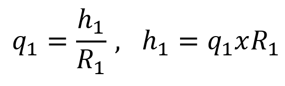
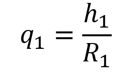
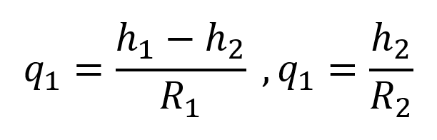

# Sistemas hidraulicos 
El título de cada clase, correspondiente al tema general que se trabaje en clase. Siempre después de cada título de clase, redactar una breve introducción (mínimo un párrafo) que de una mirada general al tema

>🔑 *Aspectos a tener en cueta:* Para estos sistemas de tanques de almacenamiento industriales se requiere mantener flujo y o niveles constantes en donde:
	 q_(i  ):Flujo de entrada. 
	q_(o   ):Flujo de salida.
	R_1:Resistencia al flujo.
	A_1:Area transversal del tanque.
	h_1:Nivel del fluido del tanque.
Ver figura1.

Por lo cual el modelo matemático es el siguiente:
 Flujo de salida: 
 .

q_1=h_1/R_1   ,   h_1=q_1 xR_1
.
Intercambio de energía: 

                                                                     A_1 x 〖dh〗_1/dt= q_i-q_1
Por lo cual se toma en cuenta que qi es la entrada del sistema y h1 como su salida…
Debido a que 
q_1=h_1/R_1 
y teniendo en cuenta que:
.
  A_1 x 〖dh〗_1/dt= q_i-q_1

podemos afirmar que:
A_1 x 〖dh〗_1/dt= q_i-h_1/R_1 
Para el caso de dos tanques separados en el cual uno alimenta a otro se realiza el análisis de los tanque por separado y la salida del primer tanque se convierte en la entrada del segundo tanque.Ver figura.2.

